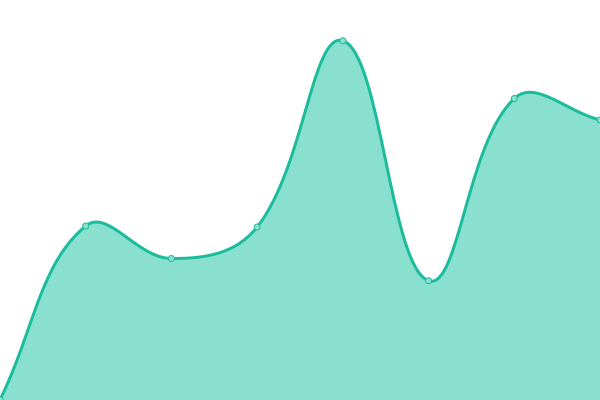

# [📈 实时状态](https://upptime.xyzzz.rr.nu): <！ -实时状态- > **所有系统都可以正常运行**

This repository contains the open-source uptime monitor and status page for [gyyst](https://upptime.xyzzz.rr.nu), powered by [Upptime](https://github.com/upptime/upptime).

With [Upptime](https://upptime.js.org), you can get your own unlimited and free uptime monitor and status page, powered entirely by a GitHub repository. We use [Issues](https://github.com/gyyst/upptime/issues) as incident reports, [Actions](https://github.com/gyyst/upptime/actions) as uptime monitors, and [Pages](https://upptime.xyzzz.rr.nu) for the status page.

<!--start: status pages-->
<!-- This summary is generated by Upptime (https://github.com/upptime/upptime) -->
<!-- Do not edit this manually, your changes will be overwritten -->
<!-- prettier-ignore -->
| URL | Status | History | Response Time | Uptime |
| --- | ------ | ------- | ------------- | ------ |
|  [nft5027](https://nft5027.crontab.rr.nu/) | 故障 | [nft5027.yml](https://github.com/gyyst/upptime/commits/HEAD/history/nft5027.yml) | 

 695毫秒
     
 | 

<a href="https://upptime.xyzzzz.ip-ddns.com/history/nft5027">0.00%</a>
    

|  [nft8gq185](https://nft8gq185.crontab.rr.nu/) | 故障 | [nft8gq185.yml](https://github.com/gyyst/upptime/commits/HEAD/history/nft8gq185.yml) | 

 735毫秒
     
 | 

<a href="https://upptime.xyzzzz.ip-ddns.com/history/nft8gq185">11.96%</a>
    

|  [cmo13698](https://cmo13698.crontab.rr.nu/) | 故障 | [cmo13698.yml](https://github.com/gyyst/upptime/commits/HEAD/history/cmo13698.yml) | 

 802毫秒
     
 | 

<a href="https://upptime.xyzzzz.ip-ddns.com/history/cmo13698">58.98%</a>
    

|  [hpzjajxgbn](https://hpzjajxgbn.crontab.rr.nu/) | 故障 | [hpzjajxgbn.yml](https://github.com/gyyst/upptime/commits/HEAD/history/hpzjajxgbn.yml) | 

 744毫秒
     
 | 

<a href="https://upptime.xyzzzz.ip-ddns.com/history/hpzjajxgbn">59.86%</a>
    

|  [pynppotvz](https://pynppotvz.crontab.rr.nu/) | 正常 | [pynppotvz.yml](https://github.com/gyyst/upptime/commits/HEAD/history/pynppotvz.yml) | 

 710毫秒
     
 | 

<a href="https://upptime.xyzzzz.ip-ddns.com/history/pynppotvz">100.00%</a>
    

|  [nblrxbwpic](https://nblrxbwpic.crontab.rr.nu/) | 正常 | [nblrxbwpic.yml](https://github.com/gyyst/upptime/commits/HEAD/history/nblrxbwpic.yml) | 

 720毫秒
     
 | 

<a href="https://upptime.xyzzzz.ip-ddns.com/history/nblrxbwpic">100.00%</a>
    

|  [yrqlrgt](https://yrqlrgt.crontab.rr.nu/) | 故障 | [yrqlrgt.yml](https://github.com/gyyst/upptime/commits/HEAD/history/yrqlrgt.yml) | 

 0毫秒
     
 | 

<a href="https://upptime.xyzzzz.ip-ddns.com/history/yrqlrgt">0.00%</a>
    

|  [gryfaem](https://gryfaem.crontab.rr.nu/) | 故障 | [gryfaem.yml](https://github.com/gyyst/upptime/commits/HEAD/history/gryfaem.yml) | 

 0毫秒
     
 | 

<a href="https://upptime.xyzzzz.ip-ddns.com/history/gryfaem">0.00%</a>
    

<!--end: status pages-->

[**Visit our status website →**](https://upptime.xyzzz.rr.nu)

## 📄 License

- Powered by: [Upptime](https://github.com/upptime/upptime)
- Code: [MIT](./LICENSE) © [Anand Chowdhary](https://anandchowdhary.com), supported by [Pabio](https://pabio.com)
- Data in the `./history` directory: [Open Database License](https://opendatacommons.org/licenses/odbl/1-0/)
